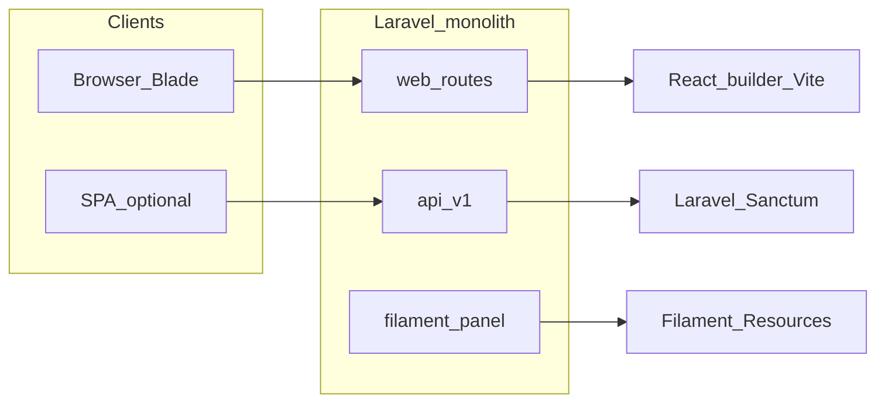

# Artixcore — project context for assistants (ChatGPT / Cursor)

Use this file as ground truth for **repository layout and runtime behavior**. The root [README.md](README.md) mixes product vision with an aspirational frontend/backend split that **does not match** the current tree.

---

## One-line summary

**Artixcore** is a Laravel 13 (PHP 8.3) monolith: a public marketing site (Blade), a versioned **REST API** under `/api/v1` for optional SPAs and integrations, embedded **React + Vite** UIs (page builder and lead intake), a **Filament** admin panel at `/filament`, a parallel **custom Blade `/admin`** console, visitor-facing **AI chat**, richer **AI/workflow** data managed in-app, **micro-tools** (catalog, runs, subscriptions, analytics), and CMS-style content (pages, articles, navigation, SEO, media).

---

## README vs this repository

- [README.md](README.md) describes a `frontend/` (Next.js) + `backend/` (Laravel) layout. **Those top-level folders are not present.**
- Actual JavaScript UI lives under [resources/js/](resources/js/) as **islands**: e.g. `resources/js/builder/`, `resources/js/intake/`, plus entrypoints [resources/js/app.js](resources/js/app.js), [resources/js/admin.js](resources/js/admin.js).
- Assets are built with **Vite** and **Tailwind CSS v4**; see [package.json](package.json) and [vite.config.js](vite.config.js) (if present at root).

---

## Tech stack (verified)

| Layer | Details |
| --- | --- |
| Framework | Laravel 13, PHP ^8.3 |
| Admin UI | Filament ^5.4 |
| API auth | Laravel Sanctum |
| Permissions / media | Spatie Laravel Permission, Spatie Laravel Media Library |
| Scheduling | Defined in [bootstrap/app.php](bootstrap/app.php): `micro-tools:aggregate-daily-stats` daily at `01:00`; `pages:publish-scheduled` every minute; **`content:generate-ai`** daily at `04:00` — orchestrates Ali 1.0 **articles** (daily caps via `AI_ARTICLE_DAILY_LIMIT`), **case studies**, and **market updates** (interval gates via `config/ai_content.php`; defaults do not auto-publish). Legacy **`articles:generate-ai`** remains a thin delegate when present. |

**Production scheduling caveat:** [.do/app.yaml](.do/app.yaml) notes DigitalOcean App Platform job cadence limits; do not assume true per-minute resolution for `everyMinute()` tasks on that platform. Prefer batch-style commands (e.g. daily **`content:generate-ai`**) on DO unless your job runner reliably fires more frequently than ~15 minutes.

---

## Routing map

### Web (Blade + session) — [routes/web.php](routes/web.php)

- Public marketing routes: home, about, services, SaaS platforms, **`/case-studies`** (canonical case studies; legacy **`/portfolio`** URLs **301** to **`/case-studies`**), **`/market-updates`**, blog, contact, get-started, careers, FAQ, legal.
- **`/login`** (guest): session login.
- **`/admin/*`**: authenticated users with middleware `blade.admin` — dashboard, site/SEO/marketing settings, navigation CRUD, resources (services, testimonials, FAQs, articles, case studies, legal pages, jobs), contact messages, media, AI providers/agents/conversations, leads, users/roles, security settings, activity logs; optional **`ai-builder-context`** behind `can:builder.access`.
- **`/builder/pages/{page}`** and **`/builder-api/v1/*`**: middleware `web`, `auth`, `builder.access`. Publish requires `can:builder.publish`; AI propose requires `can:builder.ai.use` and throttle `builder-ai-minute`.

### API — [routes/api.php](routes/api.php), prefix **`/api/v1`**

- Health: `GET /health`.
- Public reads: site, SEO settings (read), meta block types, navigation, pages by path, articles/research papers/case studies/products/team (index + show), related content, trending.
- Writes / ingest: contact, analytics events (throttled).
- **AI:** `GET /ai/agents/{slug}/profile`, `POST /ai/chat` (throttled).
- **Tools:** catalog, session (optional Sanctum), run (optional Sanctum); authenticated favorites, history, reports.
- **Sanctum:** login/logout, `/portal/me`, profile CRUD, avatar/photos.

### Filament — [app/Providers/Filament/AdminPanelProvider.php](app/Providers/Filament/AdminPanelProvider.php)

- Panel id `admin`, path **`/filament`**, login enabled.
- Resources discovered under [app/Filament/Resources/](app/Filament/Resources/).

---

## Major domains and where to look

| Domain | Starting points |
| --- | --- |
| Eloquent models | [app/Models/](app/Models/) |
| API HTTP layer | [app/Http/Controllers/Api/V1/](app/Http/Controllers/Api/V1/), JSON resources under [app/Http/Resources/Api/V1/](app/Http/Resources/Api/V1/) |
| Blade admin | [app/Http/Controllers/Admin/](app/Http/Controllers/Admin/) |
| Page builder | [app/Services/Builder/](app/Services/Builder/), [app/Http/Controllers/Web/PageBuilderController.php](app/Http/Controllers/Web/PageBuilderController.php), block typing [app/Support/Content/PageBlockType.php](app/Support/Content/PageBlockType.php) |
| Micro-tools | [app/Services/Tools/](app/Services/Tools/), [app/Providers/MicroToolsServiceProvider.php](app/Providers/MicroToolsServiceProvider.php) |
| Production CMS/domain repair | [app/Services/ProductionDomainRepairService.php](app/Services/ProductionDomainRepairService.php), [database/seeders/ProductionRemoveTestDomainSeeder.php](database/seeders/ProductionRemoveTestDomainSeeder.php), [app/Console/Commands/RepairProductionContentCommand.php](app/Console/Commands/RepairProductionContentCommand.php) |
| AI (LLM clients, etc.) | [app/Services/Ai/](app/Services/Ai/), Filament AI resources under `app/Filament/Resources/`; migrations naming `*ai*` / enterprise AI |
| Policies / authorization | [app/Policies/](app/Policies/); `master_admin` role short-circuits authorization via `Gate::before` in [app/Providers/AppServiceProvider.php](app/Providers/AppServiceProvider.php); `builder.access` / `builder.publish` / `builder.ai.use` are used as abilities (typically Spatie permission names) |

---

## Auth and permissions

- **API:** `auth:sanctum` for protected routes; alias middleware `optional.sanctum` for optional user context — see [bootstrap/app.php](bootstrap/app.php).
- **Web admin:** session `auth` plus `blade.admin` (and Spatie-backed roles where applicable).
- **Builder:** `builder.access`; sub-abilities `builder.publish`, `builder.ai.use` where routes apply.
- **Two admin UIs:** Filament at `/filament` and Blade `/admin` — feature overlap may exist; change one area if the other is not the single source of truth for that data.

---

## Environment and operations

Notable variables (see [.env.example](.env.example)):

- `APP_URL` — production should be `https://artixcore.com` (set explicitly on the host; [config/app.php](config/app.php) uses a **production-safe default** of `https://artixcore.com` when `APP_URL` is unset). Local dev overrides this in `.env` (e.g. `http://localhost:8000`).
- `CONTACT_EMAIL`, `MAIL_FROM_ADDRESS`, `LEADS_NOTIFICATION_EMAIL` — public marketing and mail defaults; production values are `hello@artixcore.com` in [.env.example](.env.example) and config fallbacks.
- `FRONTEND_URL`, `SANCTUM_STATEFUL_DOMAINS` — SPA / cross-origin cookie session assumptions.
- `TRUSTED_PROXIES` — behind load balancers (e.g. DigitalOcean).
- **AI widget:** `AI_CHAT_ENABLED`, `AI_WIDGET_AGENT_SLUG`, `AI_INTAKE_AGENT_SLUG`.
- **Intake:** `INTAKE_RATE_LIMIT_*`, `INTAKE_GEO_*`, `IPINFO_TOKEN`.
- **Media:** `MEDIA_DISK`, `DEFAULT_AVATAR_URL`.
- Queue: `QUEUE_CONNECTION`; cache: `CACHE_STORE`.

**Containers:** [Dockerfile](Dockerfile) uses a Node stage for `npm ci` / `npm run build`, copies `public/build` into PHP image, runs `composer install --no-dev`, serves via `php artisan serve` on `$PORT` (see file for exact CMD).

**DigitalOcean:** [.do/app.yaml](.do/app.yaml) defines MySQL and runtime env bindings (e.g. `DB_URL`). App Platform env should set `APP_URL`, `APP_DOMAIN` / `SANCTUM_STATEFUL_DOMAINS`, and the mail/contact vars above to match the live site.

---

## Production domain, contact email, and status

**Canonical public site:** `https://artixcore.com`. **Canonical public contact email:** `hello@artixcore.com` (mailto: `mailto:hello@artixcore.com`).

**Where the footer and JSON-LD get the email:** Blade partials (e.g. [resources/views/partials/footer.blade.php](resources/views/partials/footer.blade.php), contact/lead pages, [resources/views/partials/seo-jsonld.blade.php](resources/views/partials/seo-jsonld.blade.php)) render `$site->contact_email` from **`site_settings`** (singleton row), composed in [app/Providers/AppServiceProvider.php](app/Providers/AppServiceProvider.php). That value is **database-backed**, not solely `CONTACT_EMAIL` from config. After deploys, if the DB still contains legacy `hello@artixcore.test` or `artixcore.test` URLs (including inside JSON CMS fields), the live site will show them until repaired.

**Repair tooling (idempotent, no row deletes):**

| Mechanism | Purpose |
| --- | --- |
| [app/Services/ProductionDomainRepairService.php](app/Services/ProductionDomainRepairService.php) | Replaces legacy `artixcore.test` / `hello@artixcore.test` across scoped CMS/settings tables (strings + recursive JSON). Skips lead/contact-message **identity** email columns. |
| `php artisan db:seed --class=ProductionRemoveTestDomainSeeder --force` | Post-deploy DB repair entrypoint. |
| `php artisan artixcore:repair-production-content` | Same logic without going through `db:seed`. |
| [database/seeders/ProductionContactInfoSeeder.php](database/seeders/ProductionContactInfoSeeder.php) | Narrow fix: normalizes **`site_settings.contact_email`** only when it matches known placeholders. |

**Documentation:** Full checklist, cache commands, and verification steps live in [docs/production-verification.md](docs/production-verification.md).

**Site status (repository vs runtime):** In **this repo**, defaults and `.env.example` target production placeholders (`artixcore.com`, `hello@artixcore.com`). **Runtime** correctness on the public URL depends on **environment variables** on the host **and** MySQL content that powers `site_settings` and CMS JSON; run the repair seeder or Artisan command after deploy if historical `.test` data exists. Never use `migrate:fresh` or `db:wipe` on production.

---

## Database

Schema evolution is authoritative in [database/migrations/](database/migrations/). Includes users/sessions/cache/jobs, permissions, pages/page blocks, articles, taxonomies/terms, navigation, analytics events, micro-tools and subscriptions, SEO settings, marketing CMS extensions, enterprise AI-related tables, builder platform tables, leads, etc.

---

## Architecture sketch

---

## How assistants should use this file

1. Prefer **this document** over [README.md](README.md) for filesystem layout and runtime boundaries.
2. Re-verify contracts in [routes/web.php](routes/web.php), [routes/api.php](routes/api.php), and [composer.json](composer.json) before asserting endpoint paths or package versions.
3. When editing CMS or admin behavior, check whether **Filament**, **Blade `/admin`**, or **both** own the resource.
4. Treat [.env.example](.env.example) and migrations as the source of truth for configuration knobs and tables, not prose in older docs.
5. For **production deploys** and contact/domain correctness, follow [docs/production-verification.md](docs/production-verification.md) and the **Production domain, contact email, and status** section above.
