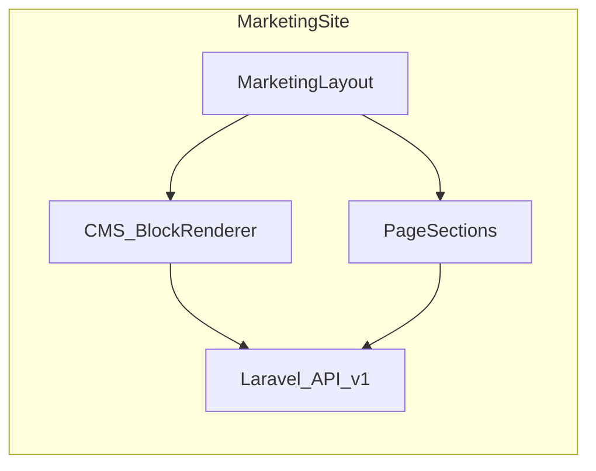

# Artixcore UI component map

Authoritative blueprint for designers, frontend (Next.js), and CMS (Laravel / Filament). This document names **target** components and sections; some items are **MVP** (ship first) vs **Phase 2** (richer UX). Tags **Existing** = present in repo today; **Planned** = add when implementing.

## Design guardrails

- **Identity:** Artixcore-first — modern, premium, futuristic, clean; not a clone of any vendor design system.
- **Execution:** Premium SaaS polish (spacing, motion restraint, crisp type).
- **Clarity:** Enterprise-grade information hierarchy — predictable section rhythm, scannable headings, strong grid alignment.
- **IBM influence:** Structural only (section order, density, labeling). **Do not** adopt IBM visual language, patterns, or component chrome.
- **Responsive:** Mobile-first; every layout must define stack, collapse, and density rules.

## Content architecture overview

## Route alignment

| Canonical URL (Next.js) | Doc page | Current implementation |
| --- | --- | --- |
| `/` | Home | `getPage("home")` blocks + `TrendingArticlesSection`; header/footer from API nav |
| `/company` | Company hub (part of About/Company) | `CmsPage path="company"` + static link cards |
| `/about` | About (mission/values narrative) | Static `Prose` page (not CMS blocks) |
| `/products` | Products overview | `CmsPage path="products"` |
| `/products/saas`, `/blockchain`, `/quantum` | Product category landings | `CmsPage` per path |
| `/services`, `/services/[slug]` | Services (related to software engineering offer) | Listing + detail |
| `/solutions`, `/solutions/*` | Solutions | `CmsPage` per route |
| `/research` | Research hub | `CmsPage path="research"` |
| `/research/papers` | Research publications index | API-driven list |
| `/research/papers/[slug]` | Research detail | API-driven detail |
| `/resources` | Resources hub | Page |
| `/resources/articles` | Articles listing | API-driven |
| `/resources/articles/[slug]` | Article detail | API-driven |
| `/resources/case-studies` | Case studies listing | API-driven |
| `/resources/case-studies/[slug]` | Case study detail | API-driven |
| `/team`, `/team/[slug]` | Team | API-driven |
| `/contact` | Contact | Dedicated page + form |
| `/account` | End-user dashboard (placeholder) | Placeholder copy |
| `/dashboard-preview` | Dashboard preview (marketing) | Preview shell |
| **Planned:** `/careers`, `/products/[slug]` | Careers; product detail | **Not in repo** — define in map for build-out |
| Laravel `/admin` (Filament) | Back office | Filament resources (see page 16) |

**IA note:** Treat **`/company`** as the CMS-driven company hub and **`/about`** as the narrative “mission / values / how we work” page unless you consolidate routes later.

---

## Global reusable component inventory

Each row: **Component** — purpose — **Existing / Planned** — typical props or data — **Used on** (abbrev.).

| Component | Purpose | Status | Notes | Used on |
| --- | --- | --- | --- | --- |
| `MarketingLayout` | Shell: header, main, footer | Existing | `frontend/src/app/(marketing)/layout.tsx` | All marketing |
| `SiteHeader` | Top bar + nav trigger | Existing | Accepts `navItems` | All marketing |
| `SiteMegaNav` | Desktop mega menu | Existing | From API tree | Home+ |
| `MobileNav` | Drawer / sheet nav | Existing | | All marketing |
| `AnnouncementBar` | Dismissible top strip (news, release) | Planned | Wire to `SiteSetting` or new field | All marketing |
| `Logo` | Brand mark | Existing | | Header, footer |
| `ThemeToggle` | Light / dark / system | Existing | | Header |
| `SiteFooter` | Links, legal, social | Existing | `exploreLinks` from API | All marketing |
| `Container` | Max-width wrapper | Existing | | Most sections |
| `Section` | Vertical rhythm, optional border | Existing | | Most sections |
| `HeroBlock` | CMS hero | Existing | Block type `hero` | CMS pages |
| `FeatureGridBlock` | CMS icon/text grid | Existing | Block type `feature_grid` | CMS pages |
| `CtaBlock` | CMS CTA band | Existing | Block type `cta` | CMS pages |
| `BlockRenderer` | Maps block types to React | Existing | Extend for new blocks | CMS pages |
| `Hero` (marketing) | Composed hero (non-CMS variant) | Existing | `components/sections/hero.tsx` | Optional static pages |
| `SocialProof` / logo strip | “Trusted by” | Existing | `social-proof.tsx` | Home, product |
| `ServicesTeaser` | Services preview | Existing | | Home |
| `TechStack` | Tech / ecosystem strip | Existing | | Home, products |
| `CtaSection` | Page-bottom CTA | Existing | | Many |
| `TrendingArticlesSection` | Article strip | Existing | API | Home |
| `Prose` | Long-form typography | Existing | | Articles, about |
| `Breadcrumb` | Wayfinding | Planned | | Detail pages |
| `SectionHeading` | Eyebrow + title + optional actions | Planned | Compose from `Section` | All |
| `LogoStrip` | Partner / client logos | Planned | CMS or static | Home, products |
| `CardGrid` | Responsive grid of cards | Planned | | Listings |
| `FeatureCard` | Icon, title, body, link | Planned | | Services, solutions |
| `ProductCard` | Product summary | Planned | From `Product` API | Products |
| `ArticleCard` | Article teaser | Planned | From `Article` API | Articles |
| `ResearchCard` | Paper / project teaser | Planned | From `ResearchPaper` API | Research |
| `CaseStudyCard` | Case teaser | Planned | From `CaseStudy` API | Case studies |
| `TeamCard` | Profile teaser | Planned | From `TeamProfile` API | Team |
| `StatsBlock` | KPI / metrics | Planned | | Case study, home |
| `TestimonialBlock` | Quote + attribution | Planned | Phase 2 | Home, solutions |
| `FilterBar` | Taxonomy / facet filters | Planned | Querystring | Listings |
| `SearchBar` | Full-text or scoped search | Planned | API param | Articles |
| `Tabs` | Secondary nav in-page | Planned | | Solutions, product detail |
| `Accordion` / `FaqSection` | FAQs | Planned | | Product, solutions |
| `DataTable` | Sortable tabular data | Planned | Admin + dashboard |
| `EmptyState` | No data UX | Planned | | Dashboard, admin |
| `DashboardSidebar` | App nav | Planned | End-user dashboard |
| `DashboardTopbar` | User menu, notifications | Planned | End-user + admin |
| `NotificationPanel` | Toast / inbox | Planned | | Dashboard |
| `ContactForm` | Lead capture | Existing | `contact-form.tsx` | Contact |

---

# Public website pages

## 1. Home page

### 1. Page name

Home

### 2. Page purpose

Establish brand, explain breadth (software, SaaS, blockchain/Solana, quantum, research, AI), route visitors to products/solutions/content, and capture interest via CTAs.

### 3. Section-by-section layout (ordered)

1. Optional `AnnouncementBar` (above header)  
2. `SiteHeader` + `SiteMegaNav` / `MobileNav`  
3. Hero (CMS `HeroBlock` or composed `Hero`)  
4. `LogoStrip` / `SocialProof` — trusted by  
5. Core services — `FeatureGridBlock` or `ServicesTeaser`  
6. Product ecosystem — cards or `FeatureGridBlock` linking to `/products` and categories  
7. Blockchain / Solana highlight — dedicated row or `FeatureGridBlock`  
8. Quantum / research highlight — teaser + link to `/research`  
9. SaaS platforms preview — cards + CTA  
10. Why Artixcore — differentiators (`FeatureGridBlock` or custom two-column)  
11. Featured articles — `TrendingArticlesSection` (Existing) + optional “featured” slot  
12. Team / leadership preview — `TeamCard` grid (API: leadership filter) **Planned**  
13. `CtaSection` or `CtaBlock` — primary conversion  
14. `SiteFooter`

### 4. Component names

`AnnouncementBar`, `SiteHeader`, `SiteMegaNav`, `MobileNav`, `HeroBlock`, `SocialProof`, `LogoStrip`, `FeatureGridBlock`, `ServicesTeaser`, `ProductCard`, `ResearchCard`, `CtaBlock`, `TrendingArticlesSection`, `TeamCard`, `CtaSection`, `SiteFooter`

### 5. What each section contains

- **Announcement:** Short message, link, dismiss.  
- **Header:** Brand, primary nav, CTA button, theme.  
- **Hero:** Headline, subcopy, primary/secondary CTA, optional visual.  
- **Trusted by:** Logo row, optional metric.  
- **Core services:** 3–6 capabilities with links.  
- **Ecosystem:** Map of product families.  
- **Blockchain:** Solana/SPL emphasis, compliance/security note.  
- **Quantum/research:** Credibility, link to papers.  
- **SaaS preview:** 2–4 platform tiles.  
- **Why us:** Proof points, methodology.  
- **Articles:** 3–6 teasers.  
- **Team preview:** Leadership faces + link to `/team`.  
- **CTA:** Book demo / contact.  
- **Footer:** Sitemap, legal, social.

### 6. Reusable components used

See [Global reusable component inventory](#global-reusable-component-inventory): layout shell, `HeroBlock`, `FeatureGridBlock`, `CtaBlock`, `TrendingArticlesSection`, `SocialProof`, optional `LogoStrip`, `TeamCard`, `CtaSection`, `SiteFooter`.

### 7. Mobile / tablet / desktop notes

- **Mobile:** Stack all sections; logo strip → horizontal scroll; product/ecosystem cards 1 column; reduce hero visual height.  
- **Tablet:** 2-column grids where noted; mega menu collapses to drawer.  
- **Desktop:** Full mega nav; 3–4 column card grids; generous whitespace.

### 8. Optional dynamic / CMS-driven areas

- **Page blocks:** `hero`, `feature_grid`, `cta` (Existing) — order from CMS.  
- **API:** Articles (`/api/v1/articles`, trending), future team leadership list.  
- **SiteSetting:** Announcement text, logo, social (Existing `/api/v1/site`).  
- **Media:** Hero art, logos from media library.  
- **SEO:** Page meta from CMS page record.

---

## 2. About / company

**Split in current codebase:** `/company` (CMS hub) + `/about` (static narrative). Below describes the **combined** blueprint; implement across both routes or merge later.

### 1. Page name

About / Company

### 2. Page purpose

Build trust through story, mission, values, people, and history; route to team and contact.

### 3. Section-by-section layout (ordered)

1. `SiteHeader` / nav  
2. Hero — company name + one-line promise  
3. Company story — long-form + timeline anchor  
4. Mission / vision — split or stacked cards  
5. Core values — `FeatureGridBlock`  
6. Leadership — `TeamCard` grid (role = leadership)  
7. Team structure — org overview diagram or text **Phase 2**  
8. Timeline / milestones — horizontal or vertical **Planned**  
9. CTA — contact / careers  
10. `SiteFooter`

### 4. Component names

`HeroBlock`, `Prose`, `SectionHeading`, `FeatureGridBlock`, `TeamCard`, `Timeline`, `CtaBlock`, `SiteFooter`

### 5. What each section contains

- **Hero:** Emotional hook + credibility line.  
- **Story:** Founding narrative, evolution, focus areas (software, SaaS, chain, quantum, AI).  
- **Mission/vision:** Concise statements.  
- **Values:** 4–6 principles with short blurbs.  
- **Leadership:** Bios, photos, optional LinkedIn.  
- **Structure:** How teams collaborate (optional).  
- **Timeline:** Key dates, releases, research milestones.  
- **CTA:** Talk to us / join team.

### 6. Reusable components used

`HeroBlock`, `FeatureGridBlock`, `CtaBlock`, `TeamCard`, `Section`, `Container`, `Prose` (for `/about` static path).

### 7. Mobile / tablet / desktop notes

- **Mobile:** Timeline → vertical; leadership cards stack; values single column.  
- **Tablet:** Two-column values; timeline compact.  
- **Desktop:** Wide story layout; leadership 3–4 columns.

### 8. Optional dynamic / CMS-driven areas

- **`/company`:** `CmsPage path="company"` blocks (Existing).  
- **Team:** `GET /api/v1/team` filtered by tag/role when available.  
- **Static `/about`:** Migrate to CMS for parity **Planned**.  
- **SEO:** Per-page metadata.

---

## 3. Products overview

### 1. Page name

Products overview

### 2. Page purpose

Orient visitors across SaaS, blockchain, quantum, engineering, and infrastructure; highlight featured offerings; deep-link to detail pages.

### 3. Section-by-section layout (ordered)

1. Header  
2. Hero  
3. Product categories — tabs or `CardGrid` (SaaS, Blockchain, Quantum, Software engineering, Infrastructure)  
4. Featured products — `ProductCard` from API  
5. Comparison or grouped cards — optional matrix **Phase 2**  
6. Technology stack / ecosystem — `TechStack`  
7. Product CTA  
8. Footer

### 4. Component names

`HeroBlock`, `Tabs`, `CardGrid`, `ProductCard`, `FeatureGridBlock`, `TechStack`, `CtaBlock`, `SiteFooter`

### 5. What each section contains

- **Hero:** Portfolio-level headline.  
- **Categories:** Short intro per pillar + link to `/products/saas` etc.  
- **Featured:** Curated slugs or “featured” flag from CMS/API.  
- **Comparison:** When to choose which product family.  
- **Stack:** Languages, chains, cloud, research tooling.  
- **CTA:** Sales or engineering consult.

### 6. Reusable components used

`HeroBlock`, `FeatureGridBlock`, `TechStack`, `CtaBlock`, `ProductCard` (Planned; today may use `FeatureGridBlock` only).

### 7. Mobile / tablet / desktop notes

- **Mobile:** Categories as accordion or vertical tabs; cards single column.  
- **Tablet:** 2-column cards.  
- **Desktop:** Horizontal tabs + 3-column grid.

### 8. Optional dynamic / CMS-driven areas

- **CMS page:** `CmsPage path="products"` (Existing).  
- **API:** `GET /api/v1/products` for cards **when product detail routes exist**.  
- **Media:** Product thumbnails.

---

## 4. Product detail (template)

**Canonical URL (planned):** `/products/[slug]` — not yet in frontend; use template for build-out.

### 1. Page name

Product detail

### 2. Page purpose

Convert interest for one product: explain fit, features, proof, and next steps.

### 3. Section-by-section layout (ordered)

1. Header  
2. Hero — product name, one-liner, primary CTA  
3. Product summary — bullets + positioning  
4. Key features — `FeatureGridBlock`  
5. Benefits — outcome-oriented list  
6. Use cases — persona or industry tiles  
7. Screenshots / UI preview — media carousel  
8. Architecture / workflow — diagram + short copy **Phase 2**  
9. Integrations / technology — logos + API note  
10. `FaqSection`  
11. CTA band  
12. Related products — `ProductCard` row  
13. Footer

### 4. Component names

`HeroBlock`, `SectionHeading`, `FeatureGridBlock`, `Tabs`, `MediaCarousel`, `LogoStrip`, `FaqSection`, `CtaBlock`, `ProductCard`

### 5. What each section contains

(As per industry-standard product page; align copy with Artixcore pillars.)

### 6. Reusable components used

`HeroBlock`, `FeatureGridBlock`, `CtaBlock`, `Accordion`, `ProductCard`, `Section`, `Container`.

### 7. Mobile / tablet / desktop notes

- **Mobile:** Carousel full-bleed; architecture diagram stacks; FAQ accordion.  
- **Tablet:** Two-column benefits/features.  
- **Desktop:** Side-by-side hero with product UI.

### 8. Optional dynamic / CMS-driven areas

- **API:** `GET /api/v1/products/{slug}` (Existing backend).  
- **Blocks:** Optional page-level blocks if product merges with CMS `Page` model **Planned**.  
- **Media:** Screenshots from media library.  
- **SEO:** Product meta, OG image.

---

## 5. Solutions page

### 1. Page name

Solutions

### 2. Page purpose

Map buyer context (industry, business type) to offerings and proof.

### 3. Section-by-section layout (ordered)

1. Header  
2. Hero  
3. Solutions by industry — `CardGrid`  
4. Solutions by business type — SMB / mid-market / enterprise  
5. Challenges we solve — problem → capability pairs  
6. Recommended platforms — links to `/products`  
7. Case studies — `CaseStudyCard` strip  
8. CTA  
9. Footer

### 4. Component names

`HeroBlock`, `FeatureGridBlock`, `CaseStudyCard`, `ProductCard`, `CtaBlock`, `Tabs`

### 5. What each section contains

- **Industry:** Regulated, fintech, research labs, startups, etc.  
- **Business type:** Buying motion differences.  
- **Challenges:** Security, scale, compliance, R&D velocity.  
- **Platforms:** Concrete product anchors.  
- **Case studies:** 2–3 teasers with metrics.

### 6. Reusable components used

`HeroBlock`, `FeatureGridBlock`, `CtaBlock`, `CaseStudyCard`, `SectionHeading`.

### 7. Mobile / tablet / desktop notes

- **Mobile:** Industry cards stack; challenges as accordion.  
- **Tablet:** 2-column industry grid.  
- **Desktop:** Optional side nav for industry anchors.

### 8. Optional dynamic / CMS-driven areas

- **CMS:** `CmsPage path="solutions"` + child routes `enterprise-saas`, `web3`, `research-platforms` (Existing paths).  
- **API:** Case studies `GET /api/v1/case-studies` for teasers.

---

## 6. Research page

### 1. Page name

Research hub

### 2. Page purpose

Show research focus, publications, featured projects, and methodology; funnel to papers and contact.

### 3. Section-by-section layout (ordered)

1. Header  
2. Hero  
3. Research focus areas — grid (quantum, AI agents, blockchain, systems, etc.)  
4. Publications — link to `/research/papers` + latest `ResearchCard`  
5. Featured projects — case-style cards  
6. Labs / innovation — optional logos / partners  
7. Methodology / philosophy — `Prose` or `FeatureGridBlock`  
8. CTA — collaborate, download, subscribe  
9. Footer

### 4. Component names

`HeroBlock`, `ResearchCard`, `FeatureGridBlock`, `CtaBlock`, `LogoStrip`, `Prose`

### 5. What each section contains

- **Focus areas:** Themes aligned to company bets.  
- **Publications:** Peer-reviewed, preprints, whitepapers.  
- **Projects:** Active labs, grants, collaborations.  
- **Methodology:** How research ties to product.

### 6. Reusable components used

`HeroBlock`, `ResearchCard`, `CtaBlock`, `TrendingArticlesSection` (optional cross-link).

### 7. Mobile / tablet / desktop notes

- **Mobile:** Publications as vertical list; featured projects stack.  
- **Tablet:** 2-column research cards.  
- **Desktop:** Highlight “featured paper” wide card.

### 8. Optional dynamic / CMS-driven areas

- **CMS:** `CmsPage path="research"` (Existing).  
- **API:** `GET /api/v1/research-papers` on hub teaser **Planned** section component.

---

## 7. Research detail / publication (template)

### 1. Page name

Research publication detail

### 2. Page purpose

Deliver a single paper or publication with metadata, findings, and related work.

### 3. Section-by-section layout (ordered)

1. Header  
2. `Breadcrumb`  
3. Hero — title, authors, date, venue  
4. Abstract / summary  
5. Main body — `Prose` + downloadable PDF CTA  
6. Key findings — pull-quote or bullet highlights  
7. Related research — `ResearchCard` row  
8. Authors / contributors — `TeamCard` or custom byline  
9. Download / CTA  
10. Footer

### 4. Component names

`Breadcrumb`, `Hero` (detail variant), `Prose`, `ResearchCard`, `TeamCard`, `CtaBlock`

### 5. What each section contains

- **Hero:** DOI, tags, reading time estimate optional.  
- **Body:** Sections, figures, equations as needed.  
- **Findings:** Non-technical summary for executives optional.  
- **Related:** Same taxonomy or manual relations **API `/related`**.

### 6. Reusable components used

`Prose`, `ResearchCard`, `CtaBlock`, `Section`, `Container`.

### 7. Mobile / tablet / desktop notes

- **Mobile:** TOC collapsible; figures full width.  
- **Tablet/Desktop:** Optional sticky TOC **Phase 2**.

### 8. Optional dynamic / CMS-driven areas

- **API:** `GET /api/v1/research-papers/{slug}` (Existing).  
- **Related:** `GET /api/v1/related` (Existing).  
- **Media:** PDF asset, cover image.  
- **SEO:** Structured data for article/scholar **Phase 2**.

---

## 8. Articles / insights listing

### 1. Page name

Articles / insights listing

### 2. Page purpose

Browse thought leadership; filter and search; subscribe.

### 3. Section-by-section layout (ordered)

1. Header  
2. Hero — insights positioning  
3. Featured article — large `ArticleCard`  
4. `FilterBar` — category / tags  
5. `SearchBar`  
6. Article grid or list — `ArticleCard`  
7. Pagination or infinite load  
8. Newsletter / CTA  
9. Footer

### 4. Component names

`HeroBlock`, `ArticleCard`, `FilterBar`, `SearchBar`, `CtaSection`, `SiteFooter`

### 5. What each section contains

- **Featured:** Editorial pick.  
- **Filters:** Taxonomy from Laravel if exposed.  
- **Grid:** Title, excerpt, date, author, read time.

### 6. Reusable components used

`HeroBlock` or page-specific hero, `ArticleCard`, `CtaSection`.

### 7. Mobile / tablet / desktop notes

- **Mobile:** Filters in bottom sheet or accordion; list view for density.  
- **Tablet:** 2-column grid.  
- **Desktop:** 3-column grid + sticky filter sidebar optional.

### 8. Optional dynamic / CMS-driven areas

- **API:** `GET /api/v1/articles` (Existing).  
- **Taxonomy:** Terms/taxonomies when exposed via API **Planned**.  
- **SEO:** Index page meta.

---

## 9. Article detail

### 1. Page name

Article detail

### 2. Page purpose

Read full insight; share; discover related content.

### 3. Section-by-section layout (ordered)

1. Header  
2. `Breadcrumb`  
3. Title block — headline, dek, meta  
4. Author + metadata — date, tags  
5. Featured image  
6. Article body — `Prose`  
7. Inline CTA / share tools — mid-article and end **Planned**  
8. Related articles  
9. Comments / discussion — **Phase 2** optional  
10. Footer

### 4. Component names

`Breadcrumb`, `Prose`, `ArticleCard`, `ShareTools`, `CommentsThread`

### 5. What each section contains

- **Share:** Copy link, social (lightweight).  
- **Related:** Same category or `/related` API.

### 6. Reusable components used

`Prose`, `ArticleCard`, `Section`, `Container`, `Badge` (Existing UI).

### 7. Mobile / tablet / desktop notes

- **Mobile:** Share row sticky bottom optional; image aspect 16:9.  
- **Desktop:** Optional reading progress bar **Phase 2**.

### 8. Optional dynamic / CMS-driven areas

- **API:** `GET /api/v1/articles/{slug}`, `GET /api/v1/related` (Existing).  
- **Media:** Hero image from CMS.  
- **SEO:** Author, published time, description.

---

## 10. Team page

### 1. Page name

Team

### 2. Page purpose

Humanize the company; show leadership and departments; recruit.

### 3. Section-by-section layout (ordered)

1. Header  
2. Hero  
3. Leadership — `TeamCard`  
4. Department grids — Research, Engineering, Marketing, Operations  
5. Join us CTA  
6. Footer

### 4. Component names

`HeroBlock`, `TeamCard`, `SectionHeading`, `CtaBlock`

### 5. What each section contains

- **Leadership:** Photos, titles, bios (short).  
- **Departments:** Grouped grids linking to `/team/[slug]` **Existing**.

### 6. Reusable components used

`TeamCard`, `CtaBlock`, `Container`, `Section`.

### 7. Mobile / tablet / desktop notes

- **Mobile:** Single column cards; department as accordion.  
- **Tablet:** 2 columns.  
- **Desktop:** 3–4 columns; optional hover bio.

### 8. Optional dynamic / CMS-driven areas

- **API:** `GET /api/v1/team`, `GET /api/v1/team/{slug}` (Existing).  
- **CMS:** Optional intro blocks via composite page **Planned**.  
- **Media:** Headshots from media library.

---

## 11. Contact page

### 1. Page name

Contact

### 2. Page purpose

Route inquiries to sales, support, partnerships; capture leads; show location.

### 3. Section-by-section layout (ordered)

1. Header  
2. Hero  
3. Contact options — channels overview  
4. Cards — Sales / Support / Partnership  
5. `ContactForm`  
6. Office / company info  
7. Map or location — **Planned** (embed or static)  
8. CTA / reassurance (SLA, response time)  
9. Footer

### 4. Component names

`HeroBlock`, `FeatureCard`, `ContactForm`, `MapEmbed`, `CtaBlock`

### 5. What each section contains

- **Cards:** Expected response, meeting booking link optional.  
- **Form:** Name, email, company, topic, message; honeypot **Planned**.  
- **Office:** Address, timezone, email from `SiteSetting`.

### 6. Reusable components used

`ContactForm` (Existing), `Section`, `Container`, `Input`, `Textarea`, `Button` (Existing UI).

### 7. Mobile / tablet / desktop notes

- **Mobile:** Form full width; map below fold.  
- **Desktop:** Two-column form + sidebar contact methods.

### 8. Optional dynamic / CMS-driven areas

- **API:** `POST /api/v1/contact` (Existing).  
- **SiteSetting:** `contact_email`, social (Existing `SiteResource`).  
- **Media:** Office photo optional.

---

## 12. Careers page

### 1. Page name

Careers

### 2. Page purpose

Attract talent; explain culture; list open roles and process.

### 3. Section-by-section layout (ordered)

1. Header  
2. Hero  
3. Why work with us  
4. Culture / benefits — `FeatureGridBlock`  
5. Open positions — list or `DataTable` lightweight **Planned** (ATS embed optional)  
6. Hiring process — steps 1–4  
7. CTA — apply, general application  
8. Footer

**Route:** `/careers` **Planned** (reference HTML exists under `public/artixcore UI` only).

### 4. Component names

`HeroBlock`, `FeatureGridBlock`, `JobList`, `Timeline`, `CtaBlock`

### 5. What each section contains

- **Why:** Mission tie-in, tech stack excitement.  
- **Benefits:** Remote, learning, equity, hardware.  
- **Roles:** Title, location, type.  
- **Process:** Screen → interview → offer.

### 6. Reusable components used

`HeroBlock`, `FeatureGridBlock`, `CtaBlock`, `Accordion` for FAQs.

### 7. Mobile / tablet / desktop notes

- **Mobile:** Job list stacked; process vertical.  
- **Desktop:** Jobs in two columns with filters **Phase 2**.

### 8. Optional dynamic / CMS-driven areas

- **CMS page:** `careers` path **Planned** or ATS iframe.  
- **Jobs:** External Greenhouse/Ashby **Phase 2** or static markdown MVP.

---

## 13. Case studies listing

### 1. Page name

Case studies

### 2. Page purpose

Prove outcomes; filter by industry; drive to detail pages.

### 3. Section-by-section layout (ordered)

1. Header  
2. Hero  
3. Featured case study — large `CaseStudyCard`  
4. Case study grid — `CaseStudyCard`  
5. Industry `FilterBar`  
6. CTA  
7. Footer

### 4. Component names

`HeroBlock`, `CaseStudyCard`, `FilterBar`, `CtaBlock`

### 5. What each section contains

- **Featured:** Metric-forward hero case.  
- **Grid:** Client, industry, outcome snippet.

### 6. Reusable components used

`CaseStudyCard`, `CtaBlock`, `SectionHeading`.

### 7. Mobile / tablet / desktop notes

- **Mobile:** Featured full width; grid single column.  
- **Desktop:** Masonry optional **Phase 2**; default uniform grid.

### 8. Optional dynamic / CMS-driven areas

- **API:** `GET /api/v1/case-studies` (Existing).  
- **Taxonomy:** Industry filter when API supports query params **Planned**.

---

## 14. Case study detail

### 1. Page name

Case study detail

### 2. Page purpose

Tell client story: challenge → solution → results with visuals.

### 3. Section-by-section layout (ordered)

1. Header  
2. Hero — client + headline outcome  
3. Client overview  
4. Challenge  
5. Solution  
6. Results — `StatsBlock`  
7. Visuals / metrics — charts, quotes  
8. Related studies — `CaseStudyCard`  
9. CTA  
10. Footer

### 4. Component names

`Hero`, `Prose`, `StatsBlock`, `TestimonialBlock`, `CaseStudyCard`, `CtaBlock`

### 5. What each section contains

- **Overview:** Industry, size, geography (non-sensitive).  
- **Results:** 3–5 quantified bullets.

### 6. Reusable components used

`Prose`, `StatsBlock`, `CaseStudyCard`, `CtaBlock`.

### 7. Mobile / tablet / desktop notes

- **Mobile:** Stats stack; pull quotes full width.  
- **Desktop:** Side-by-side challenge/solution columns.

### 8. Optional dynamic / CMS-driven areas

- **API:** `GET /api/v1/case-studies/{slug}` (Existing).  
- **Related:** `/api/v1/related`.  
- **Media:** Screenshots, diagrams.  
- **SEO:** Case meta, OG.

---

# End-user dashboard pages

## 15. End-user dashboard

**Status:** `/account` is placeholder; structure below is target IA.

### 1. Page name

Customer dashboard (signed-in)

### 2. Page purpose

Self-service for profile, billing, product access, support, notifications, and knowledge.

### 3. Section-by-section layout (per sub-area)

**Shell (all dashboard routes):** `DashboardSidebar`, `DashboardTopbar`, main content, optional `NotificationPanel`.

| Route (planned) | Sections |
| --- | --- |
| Dashboard home | Welcome, quick links, usage summary, announcements |
| Profile | Avatar, name, email, security, sessions |
| Subscription / billing | Plan, invoices, payment method, usage meters |
| Products / services | Entitlements, launch links, API keys **Phase 2** |
| Support / tickets | Ticket list, new ticket, status |
| Notifications | Inbox list, mark read |
| Knowledge / content | Saved articles, docs links |

### 4. Component names

`DashboardSidebar`, `DashboardTopbar`, `DataTable`, `EmptyState`, `Card`, `NotificationPanel`, `Tabs`, `Form` patterns

### 5. What each section contains

- **Home:** At-a-glance health of account.  
- **Profile:** Editable identity; password change **when Sanctum auth ships** (see `account/page.tsx` notes).  
- **Billing:** Stripe or similar **Planned**.  
- **Products:** Links to SaaS consoles Artixcore operates.  
- **Support:** SLA-aware messaging.  
- **Knowledge:** Deep links to `/resources/articles` and research.

### 6. Reusable components used

Shared dashboard primitives; reuse `Card`, `Badge`, `Button` from UI library.

### 7. Mobile / tablet / desktop notes

- **Mobile:** Sidebar → bottom nav or hamburger; tables become card lists.  
- **Tablet:** Collapsible sidebar.  
- **Desktop:** Persistent sidebar + `DataTable`.

### 8. Optional dynamic / CMS-driven areas

- **API:** Future authenticated endpoints (not in public `api.php` list).  
- **CMS:** Marketing content only; dashboard copy from app config **Planned**.  
- **Not CMS:** PII, billing, tickets.

---

# Back-office admin (Filament)

## 16. Back-office admin dashboard

**Surface:** Laravel Filament (`/admin`). Not Next.js.

### 1. Page name

Admin / CMS / operations

### 2. Page purpose

Manage site content, structure, media, users, roles, analytics, and future AI agent configuration.

### 3. Section-by-section layout (Filament screens)

| Admin area | Filament resource / area | Purpose |
| --- | --- | --- |
| Dashboard home | Filament default + widgets **Planned** | KPIs, queue health, recent edits |
| CMS / page builder | `PageResource`, `PageBlockResource` | Pages, ordered blocks (`hero`, `feature_grid`, `cta`, future types) |
| Menu manager | `NavMenuResource`, `NavItemResource` | Header/footer navigation |
| Media library | `MediaAssetResource` | Images, documents, alt text |
| Articles | `ArticleResource` | Insights content |
| Products | `ProductResource` | Product catalog for API |
| Research | `ResearchPaperResource` | Publications |
| Team | `TeamProfileResource` | Profiles |
| Case studies | `CaseStudyResource` | Customer stories |
| Taxonomies | `TaxonomyResource`, `TermResource` | Categories/tags |
| Users / roles | `UserResource` + Spatie permissions | Access control |
| Site / branding | `SiteSettingResource` | Name, meta, logo, social, tokens |
| Analytics | `AnalyticsEventResource` | Event review |
| AI agent admin | **Planned** — custom Filament page or resource | Prompts, tools, audit logs (not in repo yet) |

### 4. Component names (Filament / Livewire)

Filament tables, forms, relation managers, custom widgets — mirror Filament conventions (`Table`, `Form`, `Infolist`).

### 5. What each section contains

Standard CRUD per entity; page builder edits JSON block `data` matching [`schemas.ts`](../frontend/src/lib/blocks/schemas.ts) for parity with Next `BlockRenderer`.

### 6. Reusable components used

Filament primitives; shared PHP form components for block JSON **Planned**.

### 7. Mobile / tablet / desktop notes

Filament is desktop-first; mobile admin is best-effort (tables scroll horizontally).

### 8. Optional dynamic / CMS-driven areas

N/A — this **is** the CMS. Source of truth for content that flows to `GET /api/v1/*` and marketing site.

---

## CMS / dynamic content matrix

| Surface | Static UI shell | Reusable components | CMS page blocks | API entities | SiteSetting / Media |
| --- | --- | --- | --- | --- | --- |
| Home | Layout | Blocks + `TrendingArticlesSection` | Yes | Articles (section), optional team | Announcement **Planned**, logo |
| Company hub | Layout | Link cards | Yes (`company`) | — | — |
| About | Layout | `Prose` | No (static) **migrate?** | — | — |
| Products / Solutions / Research (CMS routes) | Layout | Blocks | Yes | Optional teasers | Media |
| Product detail | Layout | Template sections | Optional **Planned** | `Product` | Media |
| Research papers list/detail | Layout | Cards, `Prose` | Optional intro page | `ResearchPaper` | PDF/cover |
| Articles list/detail | Layout | Cards, `Prose` | — | `Article` | Images |
| Case studies | Layout | Cards, `Prose` | — | `CaseStudy` | Media |
| Team | Layout | Cards | Optional | `TeamProfile` | Headshots |
| Contact | Layout | Form | — | — | Email, social |
| Careers | Layout | Sections | **Planned** | Jobs **Planned** | — |
| Dashboard | App shell | Dashboard components | No | User APIs **Planned** | — |
| Filament admin | Filament | Tables/forms | Blocks via `PageBlock` | All managed models | `SiteSetting`, `MediaAsset` |

---

## Responsive patterns appendix

| Page / area | Mobile | Tablet | Desktop |
| --- | --- | --- | --- |
| Global header | Hamburger + drawer | Same + compact mega | Full mega menu |
| Home | Stack; horizontal logo scroll | 2-col cards | 3–4-col cards |
| Listings (articles, cases, papers) | List-first; filter sheet | 2-col grid | 3-col + sticky filter |
| Detail long-form | Single column; collapsible TOC **P2** | Comfortable measure | Optional sidebar TOC |
| Product detail | Carousel UI; accordion FAQs | 2-col features | Split hero |
| Contact | Full-width form | Form + sidebar | Two-column |
| Dashboard | Bottom nav / drawer | Collapsed sidebar | Expanded sidebar |
| Filament | Horizontal scroll tables | Usable forms | Optimal |

---

## Implementation hints (non-normative)

- Extend Laravel block types and `BlockRenderer` together when adding sections (e.g. `logo_strip`, `stats`, `testimonial`).  
- Keep **one** source of truth for block JSON schema (Zod in frontend + validation in Filament).  
- Prefer `GET /api/v1/site` for global chrome before hardcoding announcement copy.

---

*Document version: 1.0 — aligned with Artixcore repo routes and APIs as of authoring.*
